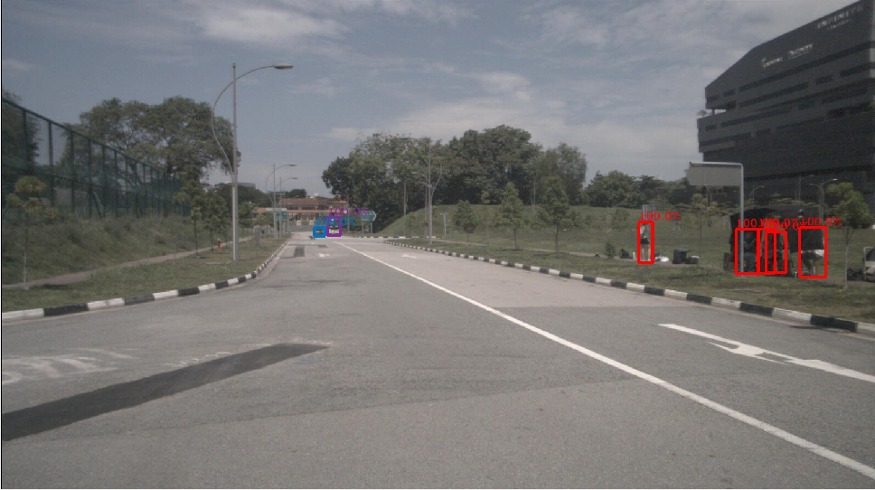

# `BoxArray2dVisualizer`

This node performs to visualize 2D bounding boxes on the image.

## Inputs & Outputs

| Name             |            Topic            | Description       |
| :--------------- | :-------------------------: | :---------------- |
| `~/input/image`  |   `sensor_msgs/msg/Image`   | Source image.     |
| `~/input/boxes`  | `mmros_msgs/msg/BoxArray2d` | 2D boxes.         |
| `~/output/image` |   `sensor_msgs/msg/Image`   | Rendering result. |

## Parameters

| Name      |  Type  | Description                                      |
| :-------- | :----: | :----------------------------------------------- |
| `use_raw` | `bool` | Indicates whether input image is not compressed. |
