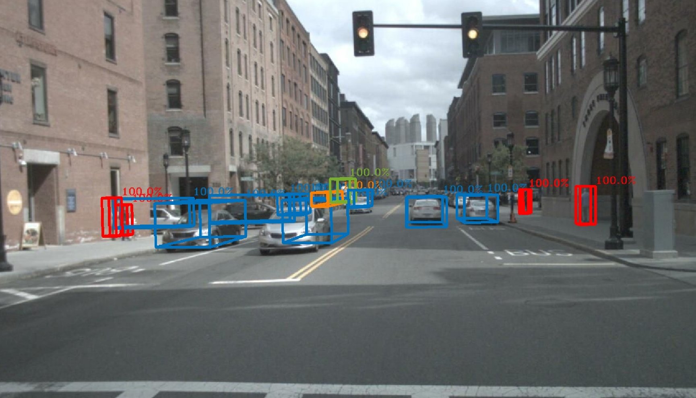

# BoxArray3dVisualizer

This performs to visualize 3D bounding boxes by projecting on the image.

## Inputs & Outputs

| Name                  |            Topic             | Description       |
| :-------------------- | :--------------------------: | :---------------- |
| `~/input/image`       |   `sensor_msgs/msg/Image`    | Source image.     |
| `~/input/camera_info` | `sensor_msgs/msg/CameraInfo` | Camera info.      |
| `~/input/boxes`       | `mmros_msgs/msg/BoxArray3d`  | 3D boxes.         |
| `~/output/image`      |   `sensor_msgs/msg/Image`    | Rendering result. |

## Parameters

| Name      |  Type  | Description                                      |
| :-------- | :----: | :----------------------------------------------- |
| `use_raw` | `bool` | Indicates whether input image is not compressed. |
