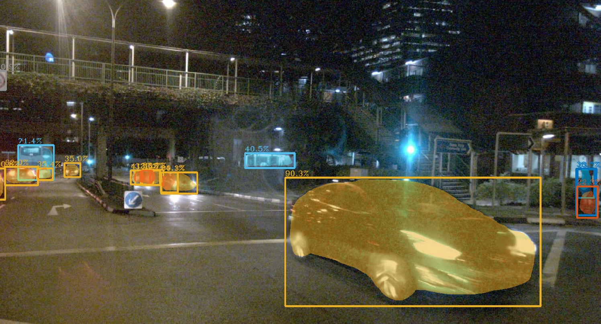

# `InstanceSegmentation2dVisualizer`

This node performs to visualize 2D instance segmentation on the image.

## Inputs & Outputs

| Name               |                  Topic                  | Description           |
| :----------------- | :-------------------------------------: | :-------------------- |
| `~/input/image`    |         `sensor_msgs/msg/Image`         | Source image.         |
| `~/input/segments` | `mmros_msgs/mgs/InstanceSegmentArray2d` | 2D instance segments. |
| `~/output/image`   |         `sensor_msgs/msg/Image`         | Rendering result.     |

## Parameters

| Name             |   Type   | Description                                      |
| :--------------- | :------: | :----------------------------------------------- |
| `mask_threshold` | `double` | Threshold value to visualize segmentation mask.  |
| `use_raw`        |  `bool`  | Indicates whether input image is not compressed. |
